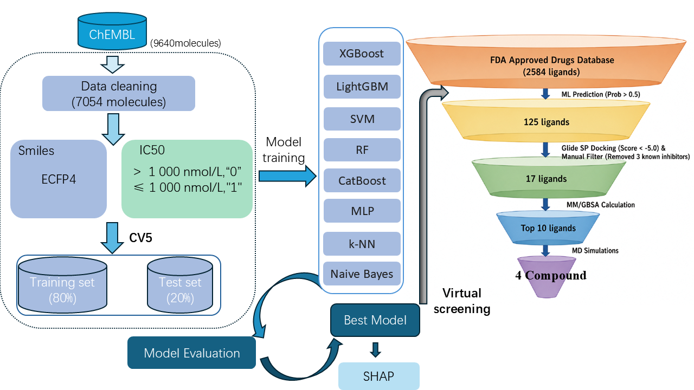

# 基于机器学习的HDAC6抑制剂预测模型的构建与应用研究毕设数据文件说明 (README)

本项目是关于 **基于机器学习的HDAC6抑制剂预测模型的构建与应用研究** 的毕业设计核心代码与数据仓储。为了方便将代码上传至 GitHub 并在学术报告与论文中展示，下文详细梳理了项目的文件结构及**机器学习与虚拟筛选阶段**的完整工作流。

---

## 📂 1. 项目文件结构 (ASCII Directory Tree)


```text
├───────── data_cleaning_activity.py           # 【步骤 1】数据清洗与标注脚本 (原始 9640 分子 -> 7054 唯一分子)
├───────── model_training_activity.py          # 【步骤 2】模型构建与评估脚本 (8大模型5折交叉验证，保存最优 XGBoost 模型)
├───────── shap_analysis_activity.py           # 【步骤 3】SHAP 全局与微观构效关系 (SAR) 解释性分析脚本
├───────── virtual_screening_activity.py       # 【步骤 4】FDA 批准上市库的机器学习初筛脚本
├───────── shap_highlight_fda.py               # 【步骤 5】SHAP 特征二维高亮脚本 (将 Top 15 关键指纹映射至老药结构)
├──────────────────────────  data/                      # 数据集存放目录 (存放原始活性数据、清洗后就绪数据等)
├──────────────────────────  ML/                        # 机器学习与模型构建 (清洗、训练、虚拟筛选脚本及最优模型和评估)
├──────────────────────────  SHAP/                      # 可解释性分析 (SHAP分析脚本、核心候选药物列表、特征高亮等)
├──────────────────────────  web_scraping/              # 网络爬虫与数据获取 (PubChem SMILES 抓取等脚本及进度文件)
├──────────────────────────  SBVS_progress/             # 对接及 MM-GBSA 结果得分表格
├──────────────────────────  MD/                        # 分子对接及分子动力学模拟 (配体准备、受体对接、MD模拟等文件)
├──────────────────────────  picture/                   # 论文和运行结果图片
└───────── README.md                           # 本说明文档文件
```

---

## 📊 2. 虚拟筛选漏斗工作流 (Virtual Screening Funnel & Code Mapping)



---

## ⚠️ 注意事项 (Data Availability)

> [!NOTE]
> 本项目中的分子动力学模拟原始轨迹与相关数据文件（`MD/data` 和 `MD/desmond_md` 目录）由于体积过大（超过数十GB），已从 GitHub 的版本控制中移除，不进行线上传输。
> 
> 如果您对这些模拟轨迹数据感兴趣或有研究需要，欢迎通过邮件联系我获取：**yanjiaqi727@163.com**
